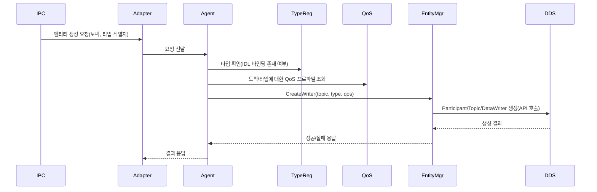
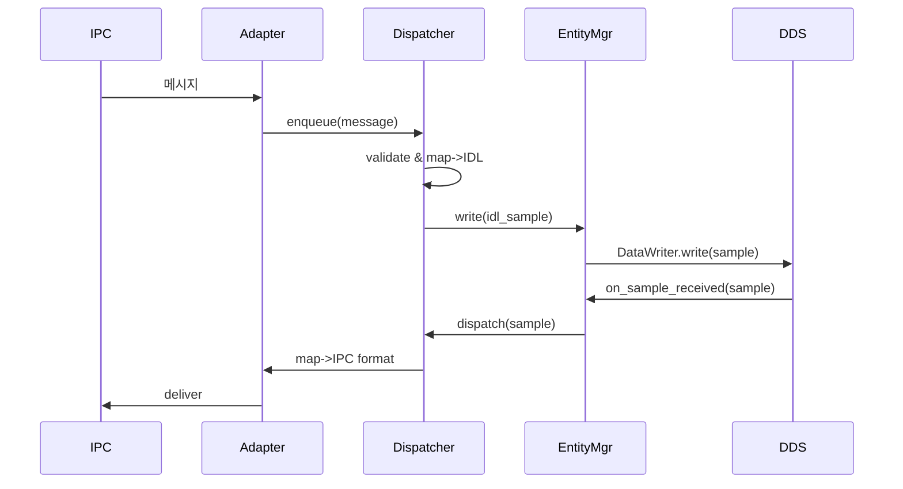

# Connext Triad Agent — 상위 설계서 초안

## 목적 및 범위
- 목적: RTI Connext DDS 기반 `Agent`의 구조적 설계(고수준)를 코드베이스를 근거로 기술한다. 핵심은 DDS 엔티티 관리, IPC 연동 흐름, 비동기(Async) 처리 분리와 IDL/코드생성( IdlKit )의 런타임 연계 방식이다.
- 범위: 런타임 동작(기동·엔티티 생성·데이터 흐름·정리), QoS 적용 원칙, IDL 코드생성과 런타임 타입 등록, 이벤트 모델(Listener vs WaitSet) 설계. 구현 파일 목록은 의도적으로 생략하고 구조·흐름 중심으로 기술한다.

## 핵심 개념 요약
- Agent는 외부 IPC 노드(프로세스/스레드/네트워크)와 DDS 사이의 브리지 역할을 수행한다.
- 주요 목표: 안정적 엔티티(Participant/Topic/Writer/Reader) 생성과 관리, IDL 기반 타입 호환성 유지, QoS 기반 정책 적용, 낮은 지연과 예측 가능한 처리 모델 제공.

## 고수준 구성(컴포넌트)
- Lifecycle Controller
  - 기동·종료 시퀀스를 제어하고 설정(`agent_config.json`)으로 초기 상태를 결정한다.

- Type Registry (IDL 런타임 바인딩)
  - 빌드 시 생성된 IDL 바인딩(헤더/타입 정보를 근거로) 또는 런타임 리플렉션을 통해 타입 정보를 수집하고, 이름 기반으로 토픽/타입 매핑을 제공한다.

- QoS Store / Profile Manager
  - QoS XML을 파싱·저장하고 엔티티 생성 요청 시 적절한 프로파일을 제공한다. 프로파일이 없으면 안전한 기본값을 반환한다.

- DDS Entity Manager
  - Participant, Topic, DataWriter, DataReader 생명주기 관리. 생성 시 Type Registry와 QoS Store에서 정보를 조회해 엔티티를 구성한다.
  - 엔티티는 내부적으로 샘플 래퍼(메시지 변환 포인트)와 연동되어 송수신 로직을 추상화한다.

- IPC Adapter
  - 외부 IPC 메시지를 수신·발행한다. 메시지 포맷 ↔ IDL 타입 매핑을 담당하며 메시지 유효성 검사, 변환 실패 정책(DLQ/드롭/재시도)을 갖는다.

- Async Dispatcher / Event Layer
  - Listener 콜백과 WaitSet 폴링을 모두 조율할 수 있는 추상 레이어.
  - 이벤트 도착시 처리 경로: IO 스레드(수신) → 변환/유효성 검사 → 워커 스레드(비지니스 처리) → DataWriter 호출 또는 IPC 전송.

- Metrics & Logging
  - 처리량·오류·레이턴시 집계와 운영 로그를 기록한다. QoS 적용 실패 등 주요 이벤트를 계측한다.

## 데이터 흐름(개념적)
아래 다이어그램은 IPC ↔ Agent ↔ DDS의 흐름을 컴포넌트 수준에서 간결히 표현한다.

```mermaid
flowchart LR
  subgraph IPC_N
    IPC[외부 IPC]
  end
  subgraph AGENT
    AAdapter[IPC Adapter]
    Dispatcher[Async Dispatcher]
    EntityMgr[DDS Entity Manager]
    TypeReg[Type Registry]
    QoS[QoS Store]
  end
  subgraph DDS_N
    DDS[RTI Connext DDS]
  end

  IPC -->|메시지| AAdapter
  AAdapter -->|파싱, 검증| Dispatcher
  Dispatcher -->|변환(IDL)| EntityMgr
  EntityMgr -->|DataWrite(프로파일 적용)| DDS

  DDS -->|샘플| EntityMgr
  EntityMgr -->|디스패치| Dispatcher
  Dispatcher -->|포맷 변환| AAdapter
  AAdapter -->|응답| IPC
```

## 핵심 시퀀스 — 엔티티 생성(예: IPC 요청에 의한 동적 Writer 생성)



설명: Type Registry와 QoS Store는 Entity Manager의 생성 경로에 절대적 의존성을 가진다. 생성 실패 시 재시도 정책(구성 가능) 또는 관리자 알림 경로를 따르도록 설계한다.

## 메시지 라운드트립(데이터 송수신) 시퀀스



## 비동기(Async) 설계 상세
- 레이어 분리 원칙
  - IO/Adapter 레이어: 외부 접점의 수신/송신만 담당(작업을 최소화). 이 레이어는 짧은 수명 주기와 낮은 지연을 우선한다.
  - Dispatcher 레이어: 수신된 메시지를 검증, IDL 매핑, 라우팅하고 비동기 작업 큐에 위임한다.
  - Worker/Business 레이어: 실제 데이터 변환, 정책 결정, EntityMgr API 호출을 수행.

- 스레드 모델(권장)
  - IO 스레드(s): Adapter 전용 스레드(또는 이벤트 루프)
  - Dispatcher 스레드(s): 이벤트 분배 및 기본 검증(작업 큐로의 안정적 전달)
  - Worker 풀: CPU 바운드/변환 작업을 위한 스레드 풀

- Backpressure & Flow Control
  - Dispatcher는 내부 큐 크기 제한, 큐 포화 시 메시지 드롭/우선순위 또는 IPC 측으로 제어 신호(예: NACK/허용 페이싱)를 지원해야 한다.

- Listener vs WaitSet 통합
  - 공통 추상: EventSource 인터페이스를 통해 Listener 콜백과 WaitSet 폴링을 동일하게 소비.
  - 실제 구현은 플랫폼/운영 모드에 따라 선택적 바인딩으로 교체 가능.

## IDLKit(코드생성)과 런타임 연계
- IDL 원본은 중앙 저장소(IdlKit/idl)에 보관하고, 빌드 파이프라인에서 코드생성(자동화 스크립트)으로 바인딩 헤더를 생성한다.
- 생성물 구분
  - 버전관리: IDL 파일만 버전관리, RTI/자동생성 소스(.cxx 등)는 빌드 산출물로 취급(커밋하지 않음).
  - 런타임은 생성된 바인딩 헤더로 타입 정보를 획득해 `Type Registry`에 등록한다.

- 런타임 등록 방법(권장)
  - 부트 시점: scan/generation manifest 또는 정적 등록 파일(emit_autoreg.py가 생성하는 등록 매핑)을 읽어 모든 타입을 등록.
  - 동적 로드: 필요 시 지연 등록(lazy registration)으로 메모리와 초기화 비용을 줄일 수 있다.

## QoS 적용 원칙(요약)
- 엔티티 생성 시점에서 QoS Store에서 Topic/Type에 맞는 프로파일을 탐색한다.
- 네이밍 우선순위: 정확 매칭(Topic+Role) → 타입 기반 매칭(Type default) → 도메인/글로벌 기본.
- 충돌 시 보수적(안전한 디폴트) 폴백.

## 오류/운영 주의사항(간단)
- 엔티티/네트워크 오류는 로그와 메트릭으로 집계하고, 재시도 정책과 관리자 경고 채널을 통해 대응한다.
- IPC/변환 레이어에서의 데이터 손실 가능성은 명확히 문서화하고 DLQ 옵션을 제공한다.

## 생성 파일 위치
- 이 문서는 워크스페이스 루트의 `ARCHITECTURE_DRAFT.md`에 위치한다.

---

파일의 추가 개선이 필요하면 어느 섹션을 확장할지 지시해 주세요(예: Async 상세 설계, QoS 매핑 표, 구체적 에러 흐름 등).
